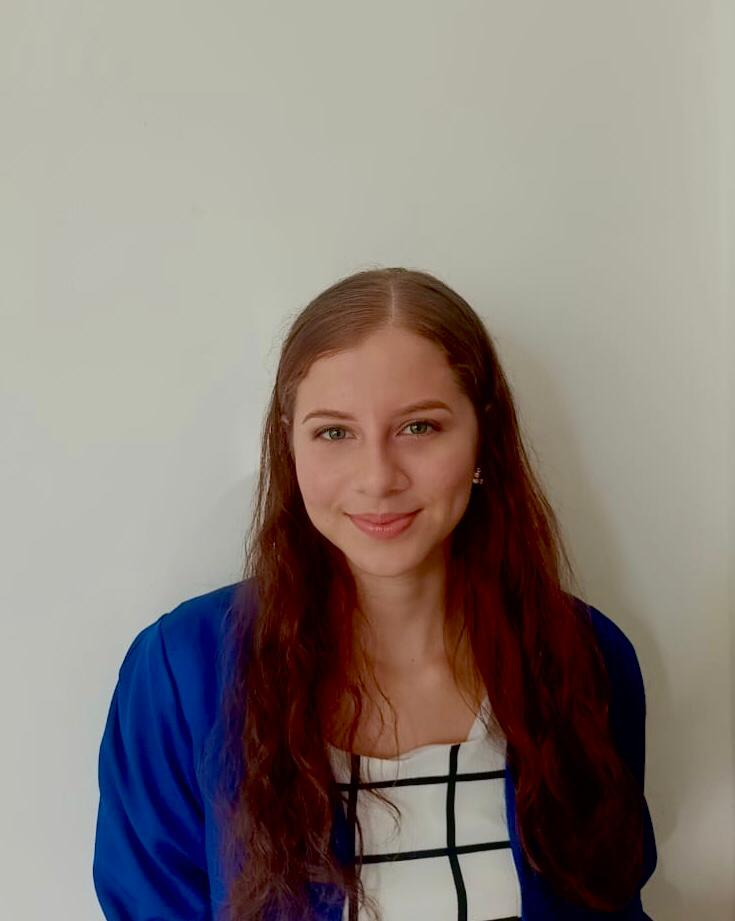

```{r, include=FALSE}
knitr::opts_chunk$set(
  results='asis', 
  echo = FALSE
)
#install.packages("dplyr",dependencies = T)
#install.packages("googlesheets4")
#install.packages("lubridate")


library(magrittr) # For the pipe
source("cv_printing_functions.r")

# Read in all data and initialize a CV printer object
CV <- create_CV_object(
  data_location = "https://docs.google.com/spreadsheets/d/1BX20I_qS1dBR-a5LvKVzJDaQJ--GOB9qjrY0xj_Kc94/",  
  pdf_mode = params$pdf_mode
)
#https://docs.google.com/spreadsheets/d/1BX20I_qS1dBR-a5LvKVzJDaQJ--GOB9qjrY0xj_Kc94/edit?usp=sharing
#https://docs.google.com/spreadsheets/d/1yCYKiTDbfYYUQYuNM304DwhUqTe4Zv-QxxfLoWPQmtY/edit?usp=sharing
#https://docs.google.com/spreadsheets/d/1yCYKiTDbfYYUQYuNM304DwhUqTe4Zv-QxxfLoWPQmtY/
```


```{r}
# When in pdf export mode the little dots are unaligned, so fix that with some conditional CSS.
if(params$pdf_mode) {
    cat("
<style>
:root{
  --decorator-outer-offset-left: -6.5px;
}
</style>")
}
```


Aside
================================================================================

```{r}

```


```{r}
if(params$pdf_mode){
  cat("View this CV online with links at _shaziaruybal.github.io/automate-cv-rmd/kate_dibiasky_datadrivencv.html_")
} else {
  cat("[<i class='fas fa-download'></i> Download a PDF of this CV](https://github.com/shaziaruybal/automate-cv-rmd/raw/main/kate_dibiasky_datadrivencv.pdf)")
}
```


```{r}
#if(params$pdf_mode){
 # cat("View this CV online with links at _shaziaruybal.github.io/automate-cv-rmd/kate_dibiasky_datadrivencv.html_")
#} else {
 # cat("[<i class='fas fa-download'></i> Download a PDF of this #CV](https://github.com/shaziaruybal/automate-cv-rmd/raw/main/kate_dibiasky_datadrivencv.pdf)")
#}
```

Contacto {#contact}
--------------------------------------------------------------------------------

```{r}
CV %>% print_contact_info()
```


Idiomas {#skills}
--------------------------------------------------------------------------------

```{r}
CV %>% print_idiom_bars()
```


Habilidades de programación {#skills}
--------------------------------------------------------------------------------

```{r}
CV %>% print_skill_bars()
```


Main
================================================================================

Hellen Espinel {#title}
--------------------------------------------------------------------------------

```{r}
# Note the special double pipe so we modify the CV object in place
CV %<>% print_text_block("intro") 
```


Educación {data-icon=graduation-cap data-concise=true}
--------------------------------------------------------------------------------

```{r}
CV %<>% print_section('education')
```


Experiencia laboral {data-icon=suitcase}
--------------------------------------------------------------------------------

::: aside
```{r}
#CV %<>% print_text_block('industy_experience_aside')
```
:::

```{r}
CV %<>% print_section('industry_positions')
```

<!-- These breaks just force a new page so section doesnt get cut off -->
<br>
<br>
<br>

<!-- Teaching Experience {data-icon=chalkboard-teacher} -->
<!-- -------------------------------------------------------------------------------- -->

<!-- ::: aside -->
<!-- ```{r} -->
<!-- CV %<>% print_text_block('teaching_experience_aside') -->
<!-- ``` -->
<!-- ::: -->


<!-- ```{r} -->
<!-- CV %<>% print_section('teaching_positions') -->
<!-- ``` -->

Experiencia docente {data-icon=chalkboard-teacher}
-------------------------------------------------------------------------------- 

```{r}
CV %<>% print_section('teaching_positions')
```


Eventos científicos {data-icon=chart-line}
-------------------------------------------------------------------------------- 

```{r}
CV %<>% print_section('data_science_writings') 
```


Capacitaciones {data-icon=laptop}
--------------------------------------------------------------------------------

```{r}
CV %<>% print_section('research_positions')
```


<!-- Selected Press (By)  {data-icon=newspaper} -->
<!-- -------------------------------------------------------------------------------- -->

<!-- ```{r} -->
<!-- CV %<>% print_section('by_me_press') -->
<!-- ``` -->


Proyectos académicos {data-icon=book}
--------------------------------------------------------------------------------

```{r}
CV %<>% print_section('academic_articles')
```


```{r}
CV %<>% print_links()
```


